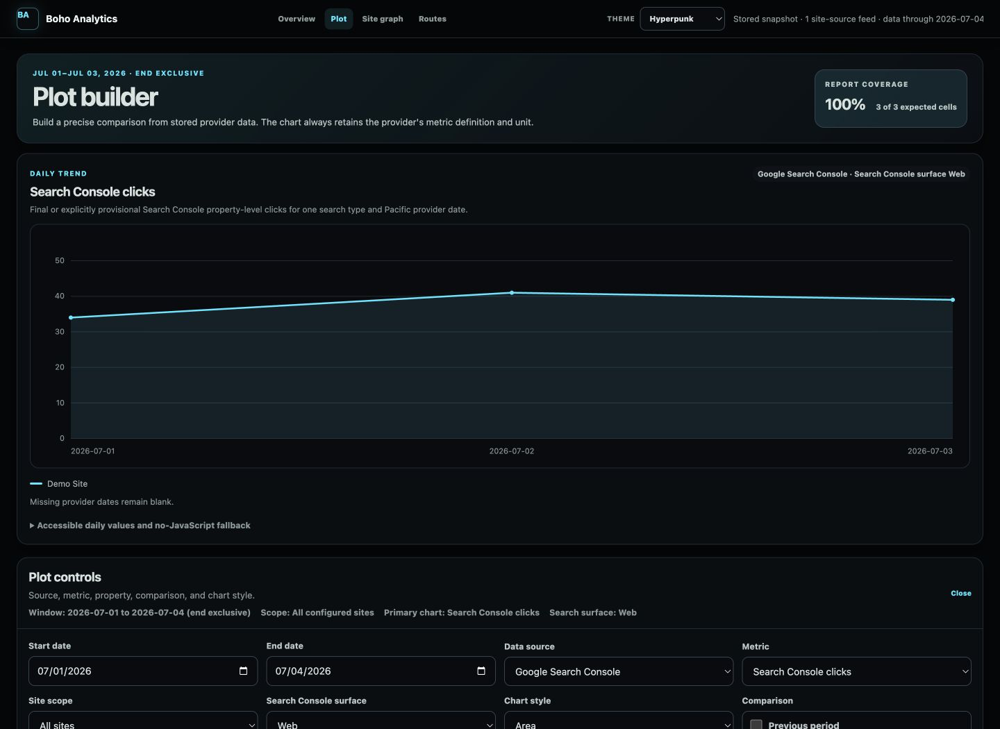
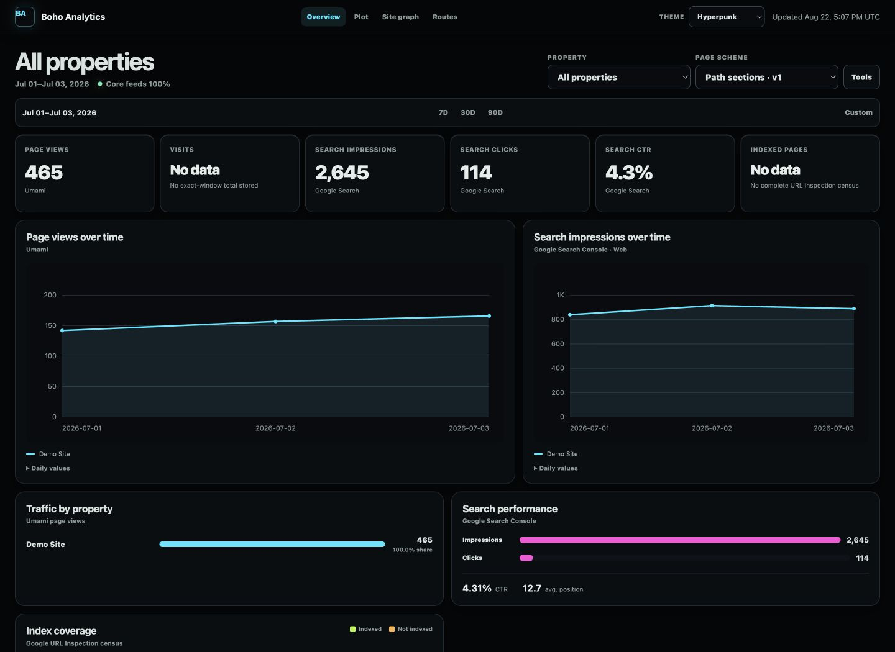

# Boho Analytics Platform

Boho Analytics Platform is a lightweight, public-first website analytics dashboard for Umami,
Cloudflare, Google Analytics, Google Search Console, and form-delivery monitoring. Its normalized
reporting plane runs on Python 3.11+ with SQLite and a dependency-free server-rendered web
interface. An optional POSIX-only Search Console bulk lane mirrors private BigQuery evidence to
Parquet on separately verified storage.

> **Status: v0.2.0 is the latest public source release.** Each installation must use
account-specific least-privilege credentials, verify the configured provider resources, and treat
incomplete coverage as incomplete rather than zero.



_Generated from sanitized illustrative data. No live analytics profile or private configuration is
used._

The browser only reads normalized local aggregates. Provider credentials stay server-side, syncs
are explicit or scheduled, and every metric remains source-labeled. The public repository contains
no client mappings, live resource IDs, credentials, submission content, or mailbox content.
The dashboard is designed for private loopback operation; this release does not provide a publicly
hosted analytics instance. Ingestion remains an operator-triggered CLI or scheduled server task and
cannot be initiated from the browser.

## V1 capabilities

- Read-only connectors for self-hosted Umami, Cloudflare GraphQL traffic analytics, GA4 Data API,
  Search Console, Cloudflare D1 form state, and the existing comms-platform SQLite mail index.
- An optional, separate `gsc-bulk` command mirrors both Search Console data tables, full successful
  `ExportLog` history for each revision, and all exported query/URL dimensions to an immutable
  private Parquet lake. It never writes those raw rows to SQLite or exposes them to the dashboard.
- Configurable form monitoring that compares durable D1 submissions and notification state with
  independently observed inbox delivery counts. It never ingests form payloads or message bodies.
- Strict schema-v2 TOML configuration with environment, systemd, and no-credential references.
- SQLite WAL storage with migrations, idempotent upserts, sync ledgers, watermarks, lease locks,
  retention, integrity checks, online backup, and guarded restore.
- A privacy-bounded Search Console index census inventories each property's public sitemap tree,
  stores URL fingerprints rather than URL text, advances within URL Inspection quotas, and reports
  published pages, indexed pages, and indexed percentage only when the current inventory is fully
  inspected.
- Saved reports, form-specific dimension filters, reusable subreports, arbitrary absolute date
  windows, site-level scope, previous-period comparisons, JSON, and downloadable CSV.
- A custom time-series Plot Builder with data-source, metric, site, exact-window, line/area/bar,
  and previous-period controls. Every selected series is also available as versioned JSON or flat CSV.
- A responsive, server-rendered command center with a confidence meter, visual KPI cards, a dominant
  interactive trend, compact evidence-based action queue, accessible daily-value fallbacks, and
  expandable data-health detail. No chart library or third-party browser asset is required.
- A provider-selectable country choropleth with US state drilldown, locally served Natural Earth and
  US Atlas boundaries, accessible ranked-value fallback, and low-volume suppression. County
  boundaries are orientation only because the configured providers do not supply trustworthy county
  aggregates; no county values are inferred from cities or IP data.
- A Site Graph dashboard for compiled repository snapshots: bounded structural SVGs, accessible
  node and edge tables, selectable link layers, two-hop page neighborhoods, goal-distance buckets,
  strongly connected components, Core 2.1 reconciliation coverage, and evidence-linked corrected
  findings. Complete coverage totals are independent of the SVG cap. It is structural evidence only
  and never presents link topology as visitor behavior.
- A read-only, summary-first `/route-observations` explorer for accepted GA4, Search Console, and
  Umami route-dimensional aggregates, with bounded raw evidence available on demand. Providers,
  metric semantics, coverage, freshness, provider date basis, and limitations remain separate; no
  raw queries, visitor/session identifiers, or full external referrer URLs are exposed.
- Loopback binding by default, Host validation, restrictive CSP, no permissive CORS, and optional
  Basic authentication.
- Failure isolation: one unavailable provider does not erase successful results from another.



## Quick start with a blank configuration

```bash
python -m venv .venv
python -m pip install --editable .
cp examples/platform.example.toml platform.toml
boho-analytics --config platform.toml config validate
boho-analytics --config platform.toml db init
boho-analytics --config platform.toml serve
```

Open `http://127.0.0.1:8787`, or forward that loopback port over SSH from a private server.

Use **Plot Builder** to select the stored data source, metric, site, dates, visual style, and optional
previous-period overlay. The browser fetches only normalized series from the local service; it never
contacts Umami, Cloudflare, or Google directly.

Copy the generic site-graph manifest to a private path, fill in the repository root, exact remote,
ref, and full commit, then inspect and ingest it. Source-only mode reads tracked files from the
recorded revision without changing the checkout or executing repository code:

```bash
boho-analytics site-graph manifest validate --manifest site-graph.yaml
boho-analytics site-graph inspect-repo --manifest site-graph.yaml
boho-analytics site-graph ingest --manifest site-graph.yaml --database var/analytics.sqlite3
boho-analytics site-graph compile --database var/analytics.sqlite3 --site example-site
boho-analytics site-graph report --database var/analytics.sqlite3 --site example-site
boho-analytics --config platform.toml serve
```

The browser route is read-only: it cannot ingest a repository, run a build, compile a graph, or sync
a provider. The same is true for `/route-observations` and its JSON/CSV exports. See
[site graph architecture](docs/site-graph/architecture.md) for the provenance and
projection model, [site graph engine](docs/site-graph/engine.md) for the full engine behavior, and
[repository ingestion](docs/site-graph/ingestion.md) for adapter behavior.

Date-window end values are exclusive. Use `--days 30` for the last 30 complete local days. A browser
request never triggers a provider sync.

## Configure real connections

Copy `examples/platform.example.toml` to a private, ignored location and replace placeholders with
the resource IDs actually available to the account. Put credentials in environment variables or
systemd credentials as JSON objects; never put values in TOML.

```json
{"api_token":"replace-at-runtime"}
```

Then initialize, probe, and sync one connection at a time:

```bash
boho-analytics --config /private/platform.toml db init
boho-analytics --config /private/platform.toml probe --connection example-umami
boho-analytics --config /private/platform.toml sync --connection example-umami --days 30
boho-analytics --config /private/platform.toml index-coverage sync
boho-analytics --config /private/platform.toml index-coverage status
```

See [configuration](docs/configuration.md), [forms monitoring](docs/forms-monitoring.md),
[provider behavior](docs/providers.md), [deployment](docs/deployment.md), and the
[Search Console BigQuery runbook](docs/gsc-bigquery-bulk-export.md) before connecting live data.

## Metric ownership

| Question | Primary source |
| --- | --- |
| Visits, pages, sessions, privacy-focused usage | Umami |
| Edge requests, visits, and response bytes | Cloudflare |
| Google acquisition, engagement, and key events | Google Analytics |
| Search impressions, clicks, CTR, and position | Google Search Console |
| Accepted submissions and notification state | Cloudflare D1 forms database |
| Notification messages observed in a mailbox | Forms inbox adapter |

Cloudflare traffic is not treated as a substitute for browser analytics. Visitor/user counts from
different providers are never silently summed or deduplicated.

## Security boundary

Keep the web service on loopback and reach it with an SSH port forward. For future remote access,
put it behind an authenticated HTTPS proxy, keep the origin private, and add tenant authorization
before exposing client data. Basic authentication is only a small deployment control; it is not a
replacement for HTTPS or an identity-aware proxy.

Read [SECURITY.md](SECURITY.md) and the [threat model](docs/threat-model.md). Architecture and data
contracts are documented under [docs](docs/architecture.md). The staged identity, authorization,
hosting, and production acceptance plan is in
[the production web application roadmap](docs/production-webapp-roadmap.md).

## Development

```bash
python -m compileall -q src
python -m unittest discover -s tests -v
python -m pip wheel . --no-deps --wheel-dir dist
```

The intended PyPI distribution name is `boho-analytics-platform`, while the installed command stays
`boho-analytics`. PyPI publication is not implied by this repository: maintainers must complete the
guarded Trusted Publishing setup and approve a release before documenting `pip install` as available.
See the [deployment and PyPI release runbook](docs/deployment.md#guarded-pypi-publishing).

See [CONTRIBUTING.md](CONTRIBUTING.md). The project is MIT licensed.
